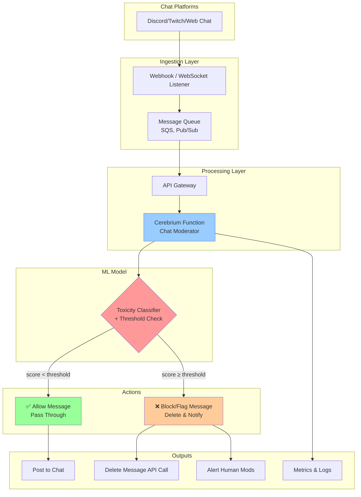

# Serverless Chat Moderation with Cerebrium

This repo demonstrates how to build a real-time, serverless chat moderation pipeline using Cerebrium and an LLM-powered toxicity classifier. The system processes thousands of messages per second—perfect for live events, streaming platforms, or online communities—without provisioning any infrastructure.

---

## Architecture Overview



---

## How It Works

* **Input**: Chat messages from Twitch, Discord, or custom clients via webhook or WebSocket.
* **Processing**: Messages are queued and sent to a Cerebrium-hosted function that applies an LLM toxicity model.
* **Moderation Logic**: Based on a configurable threshold, messages are allowed or flagged for deletion.
* **Output**: Clean messages are posted back; flagged ones are deleted or escalated. Metrics are emitted for monitoring.

---

## Getting Started

```bash
pip install cerebrium
cerebrium login
cerebrium init chat-moderator
cd chat-moderator
```

Add the moderation logic in `main.py` (see example in this repo), and configure:

```toml
[cerebrium.dependencies.pip]
torch = "latest"
transformers = "latest"

[cerebrium.environment]
TOXICITY_THRESHOLD = "0.1"
```

Then deploy:

```bash
cerebrium deploy
```

Test with:

```bash
curl -X POST \
  https://api.cortex.cerebrium.ai/v4/<project-id>/chat-moderator/run \
  -H "Authorization: Bearer <YOUR_TOKEN>" \
  -H "Content-Type: application/json" \
  --data '{"messages":[{"id":"1","text":"Hello!"}, {"id":"2","text":"Fuck"}]}'
```

---

## Use Cases

* **Livestreams & Tournaments**: Filter profanity and abuse in high-velocity chats.
* **Online Communities**: Automatically enforce safety in Discord, Slack, or Telegram groups.
* **Youth & Education Platforms**: Apply stricter thresholds to protect vulnerable audiences.
* **Moderation as a Service**: Drop this API into any app that handles user-generated content.

---

## Benefits

* **Zero Infrastructure**: No servers, scaling policies, or containers to manage.
* **Elastic Scaling**: Handles spikes of 10K+ messages/sec without dropped traffic.
* **Pay Only When Used**: No idle cost—functions scale to zero.
* **Configurable Sensitivity**: Adjust moderation thresholds in seconds via environment variables.
* **Model Flexibility**: Swap out or fine-tune LLMs to suit different communities or risk profiles.

---

## Comparative Benefits

| Feature                  | Serverless (Cerebrium)               | Self‑Hosted Server                      | Third‑Party Paid API                  |
| ------------------------ | ------------------------------------ | --------------------------------------- | ------------------------------------- |
| **Setup Time**           | Minutes (CLI + code)                 | Days/weeks (provision, configure infra) | Minutes (API key), but limited custom |
| **Operational Overhead** | None – zero infra management         | High – patching, scaling, monitoring    | None– but black‑box                   |
| **Cost Model**           | Pay‑per‑use by the second            | Fixed servers + idle costs              | Subscription or per‑call fees         |
| **Scalability**          | Automatic burst scaling to zero      | Manual/auto‑scaling setup required      | Limited by vendor quotas or tiers     |
| **Customization**        | Full model & threshold control       | Full control                            | Model/rule limits per provider        |
| **Latency**              | Tunable (CPU/GPU choices)            | Depends on server size                  | Varies by provider                    |
| **Vendor Lock‑In**       | Low – open models, code in your repo | None                                    | High                                  |

---

## Customization

* **Threshold Tuning**: Set `TOXICITY_THRESHOLD` via `cerebrium.toml` or dashboard.
* **Model Swap**: Replace `unitary/toxic-bert` with any HuggingFace model.
* **Latency Tuning**: Enable GPU or adjust memory for faster response.

---

## Contributing

We welcome contributions for:

* Additional moderation models (spam, hate speech, etc.)
* Platform integrations (Twitch bot, Slack mod hook, etc.)
* Shadow mode & A/B experimentation features

---

## License

MIT License. Use freely, deploy responsibly.
# serverless-chat-moderator
